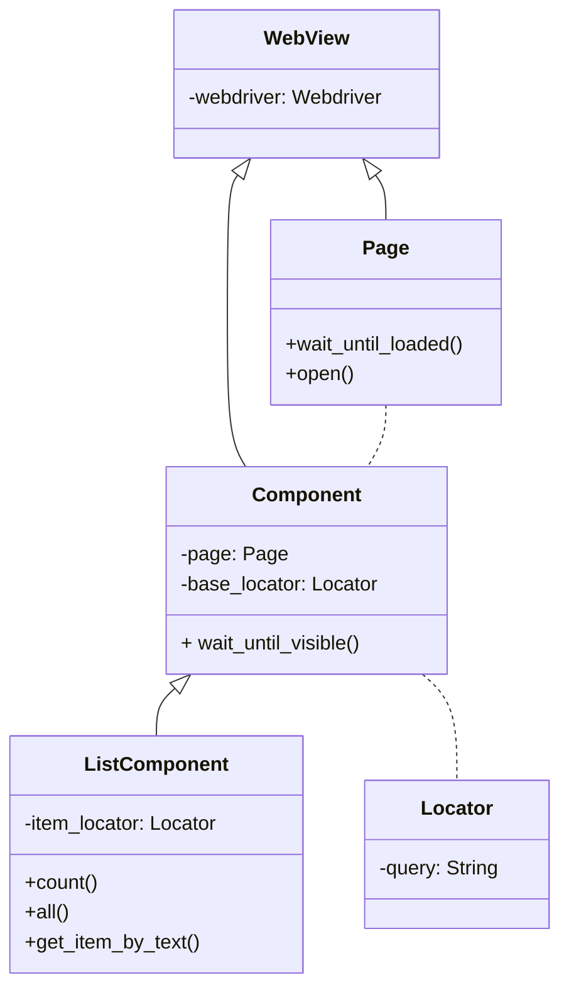

# Pomcorn

      [](https://github.com/psf/black) [](https://pycqa.github.io/isort/)

**Pomcorn**, or **Page Object Model corn**, is a Python package that contains base classes to create systems based on [Selenium](https://github.com/SeleniumHQ/selenium#selenium) framework and **Page Object Model** pattern. You can read more about this pattern [here](https://www.selenium.dev/documentation/test_practices/encouraged/page_object_models/). The package can be used to create autotesting systems, parsing scripts and anything that requires
interaction with the browser.

The package includes next base classes to create Page Object Model (``POM``) pages:



It also includes [classes to locate elements](https://pomcorn.readthedocs.io/en/latest/locators.html) on the web page and a number of additional [waiting conditions](https://pomcorn.readthedocs.io/en/latest/waits_conditions.html>).

## Installation

You can install it by **pip**:

```bash
  pip install pomcorn
```

Or **poetry**:

```bash
  poetry add pomcorn
```

## Documentation

Link to the documentation: [http://pomcorn.rtfd.io/](http://pomcorn.rtfd.io/).

## Usage

You need to [install pomcorn](https://pomcorn.readthedocs.io/en/latest/installation.html) and [Chrome webdriver](https://pomcorn.readthedocs.io/en/latest/installation.html#chrome-driver).

Below is the code that opens ``PyPI.org``, searches for packages by name and prints names of found packages to the terminal. The script contains all base classes contained in ``pomcorn``: **Page**, **Component**, **ListComponent** and **Element**.

```python

  from typing import Self

  from selenium.webdriver import Chrome
  from selenium.webdriver.common.keys import Keys
  from selenium.webdriver.remote.webdriver import WebDriver

  from pomcorn import Component, Element, ListComponent, Page, locators


  # Prepare base page
  class PyPIPage(Page):

      APP_ROOT = "https://pypi.org"

      search = Element(locators.IdLocator("search"))

      def check_page_is_loaded(self) -> bool:
          return self.init_element(locators.TagNameLocator("main")).is_displayed


  # Prepare components
  Package = Component[PyPIPage]


  class PackageList(ListComponent[Package, PyPIPage]):

      item_class = Package
      relative_item_locator = locators.ClassLocator("snippet__name")

      @property
      def names(self) -> list[str]:
          return [package.body.get_text() for package in self.all]


  # Prepare search page
  class SearchPage(PyPIPage):

      @classmethod
      def open(cls, webdriver: WebDriver, **kwargs) -> Self:
          pypi_page = super().open(webdriver, **kwargs)
          # Specific logic for PyPI for an open search page
          pypi_page.search.fill("")
          pypi_page.search.send_keys(Keys.ENTER)
          return cls(webdriver, **kwargs)

      @property
      def results(self) -> PackageList:
          return PackageList(
              page=self,
              base_locator=locators.PropertyLocator(
                  prop="aria-label",
                  value="Search results",
              ),
          )

      def find(self, query: str) -> PackageList:
          self.search.fill(query)
          self.search.send_keys(Keys.ENTER)
          return self.results


  search_page = SearchPage.open(webdriver=Chrome())
  print(search_page.find("saritasa").names)
  search_page.webdriver.close()
```

For more information about package classes, you can read in [Object Hierarchy](https://pomcorn.readthedocs.io/en/latest/objects_hierarchy.html) and [Developer Interface](https://pomcorn.readthedocs.io/en/latest/developer_interface.html).

Also you can try our [demo autotests project](https://pomcorn.readthedocs.io/en/latest/demo.html).
