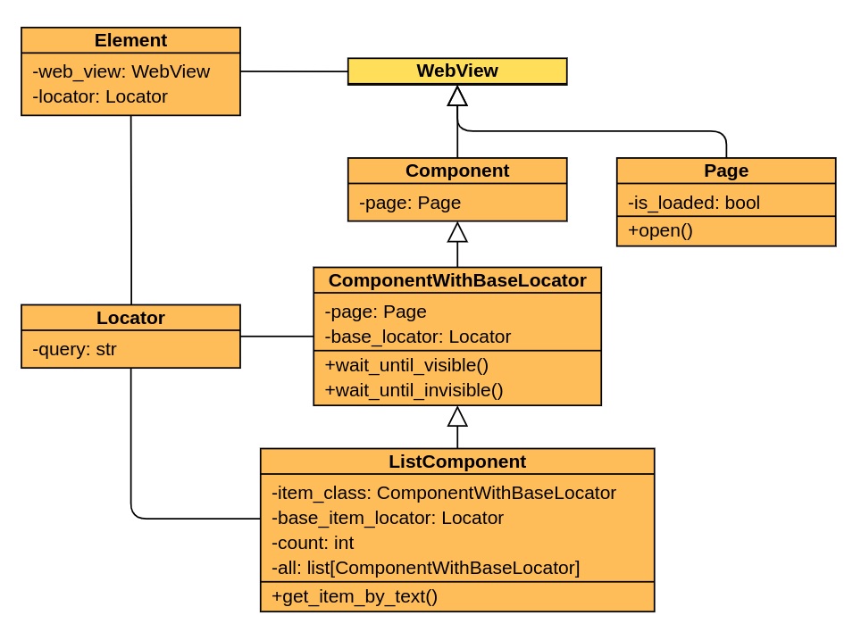

===============================================================================
Pomcorn
===============================================================================

.. image:: https://img.shields.io/github/actions/workflow/status/saritasa-nest/pomcorn/pre-commit.yml
	:target: https://img.shields.io/
	:alt: GitHub Workflow Status (with event)

.. image:: https://img.shields.io/pypi/v/pomcorn
	:target: https://img.shields.io/
	:alt: PyPI

.. image:: https://img.shields.io/pypi/status/pomcorn
	:target: https://img.shields.io/
	:alt: PyPI - Status

.. image:: https://img.shields.io/pypi/pyversions/pomcorn
	:target: https://img.shields.io/
	:alt: PyPI - Python Version

.. image:: https://img.shields.io/pypi/l/pomcorn
	:target: https://img.shields.io/
	:alt: PyPI - License

.. image:: https://img.shields.io/pypi/dm/pomcorn
	:target: https://img.shields.io/
	:alt: PyPI - Downloads

.. image:: https://img.shields.io/badge/code%20style-black-000000.svg
	:target: https://github.com/psf/black
	:alt: Code style: black

.. image:: https://img.shields.io/badge/%20imports-isort-%231674b1?style=flat&labelColor=ef8336
	:target: https://pycqa.github.io/isort/
	:alt: Imports: isort

**Pomcorn**, or **Page Object Model corn**, is a Python package that contains base classes to create
systems based on `Selenium <https://github.com/SeleniumHQ/selenium#selenium>`_ framework and
**Page Object Model** pattern. You can read more about this pattern
`here <https://www.selenium.dev/documentation/test_practices/encouraged/page_object_models/>`_.
The package can be used to create autotesting systems, parsing scripts and anything that requires
interaction with the browser.

The package includes next base classes to create Page Object Model (``POM``) pages:

It also includes
`classes to locate elements <https://pomcorn.readthedocs.io/en/latest/locators.html>`_
on the web page and a number of additional
`waiting conditions  <https://pomcorn.readthedocs.io/en/latest/waits_conditions.html>`_.

*******************************************************************************
Installation
*******************************************************************************

You can install it by **pip**:

.. code-block:: console

    $ pip install pomcorn

Or **poetry**:

.. code-block:: console

    $ poetry add pomcorn

*******************************************************************************
Documentation
*******************************************************************************

Link to the documentation: http://pomcorn.rtfd.io/.

*******************************************************************************
Usage
*******************************************************************************

You need to
`install pomcorn <https://pomcorn.readthedocs.io/en/latest/installation.html>`_ and
`Chrome webdriver <https://pomcorn.readthedocs.io/en/latest/installation.html#chrome-driver>`_.

Below is the code that opens ``PyPI.org``, searches for packages by name and prints names of found
packages to the terminal. The script contains all base classes contained in ``pomcorn``: **Page**,
**ComponentWithBaseLocator**, **ListComponent** and **Element**.

.. /* yaspeller ignore:start */

.. code-block:: python

  from typing import Self

  from selenium.webdriver import Chrome
  from selenium.webdriver.common.keys import Keys
  from selenium.webdriver.remote.webdriver import WebDriver

  from pomcorn import ComponentWithBaseLocator, Element, ListComponent, Page, locators

  # Prepare base page
  class PyPIPage(Page):

      APP_ROOT = "https://pypi.org"

      def check_page_is_loaded(self) -> bool:
          return self.init_element(locator=locators.TagNameLocator("main")).is_displayed

      @property
      def search(self) -> Element[locators.XPathLocator]:
          return self.init_element(locator=locators.IdLocator("search"))

  # Prepare components
  Package = ComponentWithBaseLocator[PyPIPage]

  class PackageList(ListComponent[Package, PyPIPage]):

      item_class = Package

      @property
      def base_item_locator(self) -> locators.XPathLocator:
          return self.base_locator // locators.ClassLocator("snippet__name")

      @property
      def names(self) -> list[str]:
          return [package.body.get_text() for package in self.all]

  # Prepare search page
  class SearchPage(PyPIPage):

      @classmethod
      def open(cls, webdriver: WebDriver, **kwargs) -> Self:
          pypi_page = super().open(webdriver, **kwargs)
          # Specific logic for PyPI for an open search page
          pypi_page.search.fill("")
          pypi_page.search.send_keys(Keys.ENTER)
          return cls(webdriver, **kwargs)

      @property
      def results(self) -> PackageList:
          return PackageList(
              page=self,
              base_locator=locators.PropertyLocator(
                  prop="aria-label",
                  value="Search results",
              ),
          )

      def find(self, query: str) -> PackageList:
          self.search.fill(query)
          self.search.send_keys(Keys.ENTER)
          return self.results

  search_page = SearchPage.open(webdriver=Chrome())
  print(search_page.find("saritasa").names)

.. /* yaspeller ignore:end */

For more information about package classes, you can read in `Object Hierarchy <https://pomcorn.readthedocs.io/en/latest/objects_hierarchy.html>`_
and `Developer Interface <https://pomcorn.readthedocs.io/en/latest/developer_interface.html>`_.

Also you can try our `demo autotests project <https://pomcorn.readthedocs.io/en/latest/demo.html>`_.
