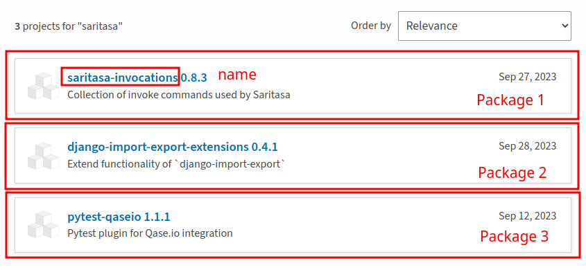
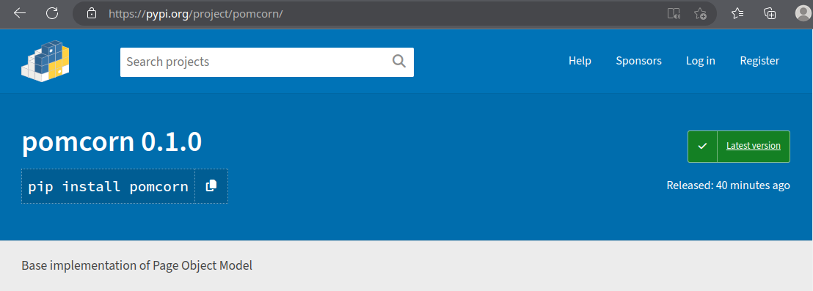

===============================================================================
Demo Autotests Project
===============================================================================

| This is a demo autotest project implemented with ``pomcorn`` package for ``PyPI`` web site.
| To start tests in this project you need to prepare a python virtual environment and install
  according driver for Chrome browser.

You can get a demo project from
`package repository <https://github.com/saritasa-nest/pomcorn/tree/main/demo>`_.

Setup
*******************************************************************************

Environment
-------------------------------------------------------------------------------

The simplest way to configure a proper Python version and virtual environment
is using `pyenv <https://github.com/pyenv/pyenv>`_ and `poetry <https://pypi.org/project/poetry/>`_.

1. Prepare python interpreter:

.. code-block:: console

    $ pyenv install 3.12
    $ pyenv shell $(pyenv latest 3.12)

2. Install dependencies

.. code-block:: console

    $ pip install -U poetry
    $ poetry config virtualenvs.in-project true && poetry install --only main,demo && poetry shell

3. `Install Chrome webdriver <https://pomcorn.readthedocs.io/en/latest/installation.html#chrome-driver>`_.

Running Autotests
*******************************************************************************
To run tests, use invoke command ``pytest``:

.. code-block:: console

  $ inv pytest.run

About the project
*******************************************************************************

This project is a mini autotesting system for the `PyPI <https://pypi.org/>`_ website.
It implements the basic structure of pages and tests according to **Page Object Model** pattern.

The project structure looks like this
(``__init__.py`` files were skipped to simplify the structure):

.. parsed-literal::

  │ `demo/ <https://github.com/saritasa-nest/pomcorn/tree/main/demo>`_
  ├── `pages/ <#pages>`_
  │   ├── `base/ <#base-folder>`_
  │   │   ├── `base_components.py <#base-components>`_
  │   │   └── `base_page.py <#base-page>`_
  │   ├── `common/ <#common>`_
  │   │   ├── `navigation_bar.py <#navigation-bar>`_
  │   │   └── `search.py <#search-component>`_
  │   ├── `search_page/ <#search-page-folder>`_
  │   │   ├── `components/ <#search-page-components>`_
  │   │   │   ├── `package_list.py <#package-list>`_
  │   │   │   └── `package.py <#package>`_
  │   │   └── `search_page.py <#search-page>`_
  │   ├── `help_page.py <#help-page>`_
  │   ├── `index_page.py <#index-page>`_
  │   └── `package_details_page.py <#package-details-page>`_
  ├── `tests <#tests>`_
  │   ├── `test_logo.py <#test-logo>`_
  │   └── `test_search.py <#test-search>`_
  └── `conftest.py <#conftest>`_

Pages
-------------------------------------------------------------------------------

This folder contains the page and component classes required to represent PyPI web pages.
These classes contain web page interaction logic to make tests free of that implementation.

Base Folder
^^^^^^^^^^^^^^^^^^^^^^^^^^^^^^^^^^^^^^^^^^^^^^^^^^^^^^^^^^^^^^^^^^^^^^^^^^^^^^^

Basic classes for PyPI pages and components are implemented here.

Base Components
"""""""""""""""""""""""""""""""""""""""""""""""""""""""""""""""""""""""""""""""

.. literalinclude:: ../demo/pages/base/base_components.py
    :language: python

Base Page
"""""""""""""""""""""""""""""""""""""""""""""""""""""""""""""""""""""""""""""""

.. note::
    The ``is_loaded`` property and the ``APP_ROOT`` attribute require special attention here.

.. literalinclude:: ../demo/pages/base/base_page.py
    :language: python

Common
^^^^^^^^^^^^^^^^^^^^^^^^^^^^^^^^^^^^^^^^^^^^^^^^^^^^^^^^^^^^^^^^^^^^^^^^^^^^^^^

This folder contains components common to multiple pages.

Navigation Bar
"""""""""""""""""""""""""""""""""""""""""""""""""""""""""""""""""""""""""""""""

This class represents navigation bar on the top side of all PyPI pages.

.. literalinclude:: ../demo/pages/common/navigation_bar.py
    :language: python

Search component
"""""""""""""""""""""""""""""""""""""""""""""""""""""""""""""""""""""""""""""""

This class represents a search field that can be placed on multiple pages.

.. list-table:: Search field examples
    :class: borderless

    * - `Index page <https://pypi.org/>`_
    * - .. image:: ../docs/_static/images/pypi_search_index.png
            :alt: Search field on PyPI index page

    * - `Navbar <https://pypi.org/search/>`_
    * - .. image:: ../docs/_static/images/pypi_search_navbar.png
            :alt: Search field on PyPI navigation bar

.. literalinclude:: ../demo/pages/common/search.py
    :language: python

Search Page Folder
^^^^^^^^^^^^^^^^^^^^^^^^^^^^^^^^^^^^^^^^^^^^^^^^^^^^^^^^^^^^^^^^^^^^^^^^^^^^^^^

Search Page Components
"""""""""""""""""""""""""""""""""""""""""""""""""""""""""""""""""""""""""""""""

Because a number of additional components needed to be created to implement the search page,
a separate folder was created for this page. This is where the page itself and its dependent
components are stored.

Package List
~~~~~~~~~~~~~~~~~~~~~~~~~~~~~~~~~~~~~~~~~~~~~~~~~~~~~~~~~~~~~~~~~~~~~~~~~~~~~~~

This class represents a list of found packages on the PyPI search page.

.. literalinclude:: ../demo/pages/search_page/components/package_list.py
    :language: python

Package
~~~~~~~~~~~~~~~~~~~~~~~~~~~~~~~~~~~~~~~~~~~~~~~~~~~~~~~~~~~~~~~~~~~~~~~~~~~~~~~

This class represents one found package listed on the PyPI search page.

.. literalinclude:: ../demo/pages/search_page/components/package.py
    :language: python

Search Page
~~~~~~~~~~~~~~~~~~~~~~~~~~~~~~~~~~~~~~~~~~~~~~~~~~~~~~~~~~~~~~~~~~~~~~~~~~~~~~~

This class represents the PyPI `search page <https://pypi.org/search/>`_.

.. literalinclude:: ../demo/pages/search_page/search_page.py
    :language: python

Help Page
^^^^^^^^^^^^^^^^^^^^^^^^^^^^^^^^^^^^^^^^^^^^^^^^^^^^^^^^^^^^^^^^^^^^^^^^^^^^^^^

This class represents the PyPI `help page <https://pypi.org/help/>`_. The ``title`` property is
implemented here to show how you can use page properties to implement the ``is_loaded`` property.

.. literalinclude:: ../demo/pages/help_page.py
    :language: python

Index Page
^^^^^^^^^^^^^^^^^^^^^^^^^^^^^^^^^^^^^^^^^^^^^^^^^^^^^^^^^^^^^^^^^^^^^^^^^^^^^^^

This class represents the PyPI `start page <https://pypi.org/>`_. This page shows the use
of the class `Search component <#search-component>`_.

.. literalinclude:: ../demo/pages/index_page.py
    :language: python

Package Details Page
^^^^^^^^^^^^^^^^^^^^^^^^^^^^^^^^^^^^^^^^^^^^^^^^^^^^^^^^^^^^^^^^^^^^^^^^^^^^^^^

This class represents the PyPI
`package details page <https://pypi.org/project/pomcorn/>`_.

.. literalinclude:: ../demo/pages/package_details_page.py
    :language: python

.. note::
    You don't have to implement the ``is_loaded`` page property if this property is set on the base
    page and is appropriate for the current page.

Tests
-------------------------------------------------------------------------------

This folder contains autotests that use pages prepared in `fixtures <#conftest>`__ to reproduce
some scenarios of user interaction with the site.

Test Logo
^^^^^^^^^^^^^^^^^^^^^^^^^^^^^^^^^^^^^^^^^^^^^^^^^^^^^^^^^^^^^^^^^^^^^^^^^^^^^^^

.. literalinclude:: ../demo/tests/test_logo.py
    :language: python

Test Search
^^^^^^^^^^^^^^^^^^^^^^^^^^^^^^^^^^^^^^^^^^^^^^^^^^^^^^^^^^^^^^^^^^^^^^^^^^^^^^^

.. literalinclude:: ../demo/tests/test_search.py
    :language: python

Conftest
-------------------------------------------------------------------------------

Here are the implemented base `fixtures <https://docs.pytest.org/en/6.2.x/fixture.html#fixtures>`__
for implemented PyPI pages. This is useful practice to avoid duplicating page opening calls in
each test.
Also, the `webdriver <https://www.selenium.dev/selenium/docs/api/py/api.html#webdriver-chrome>`_
fixture with a given window size (1920×1080) is implemented here.

.. literalinclude:: ../demo/conftest.py
    :language: python
